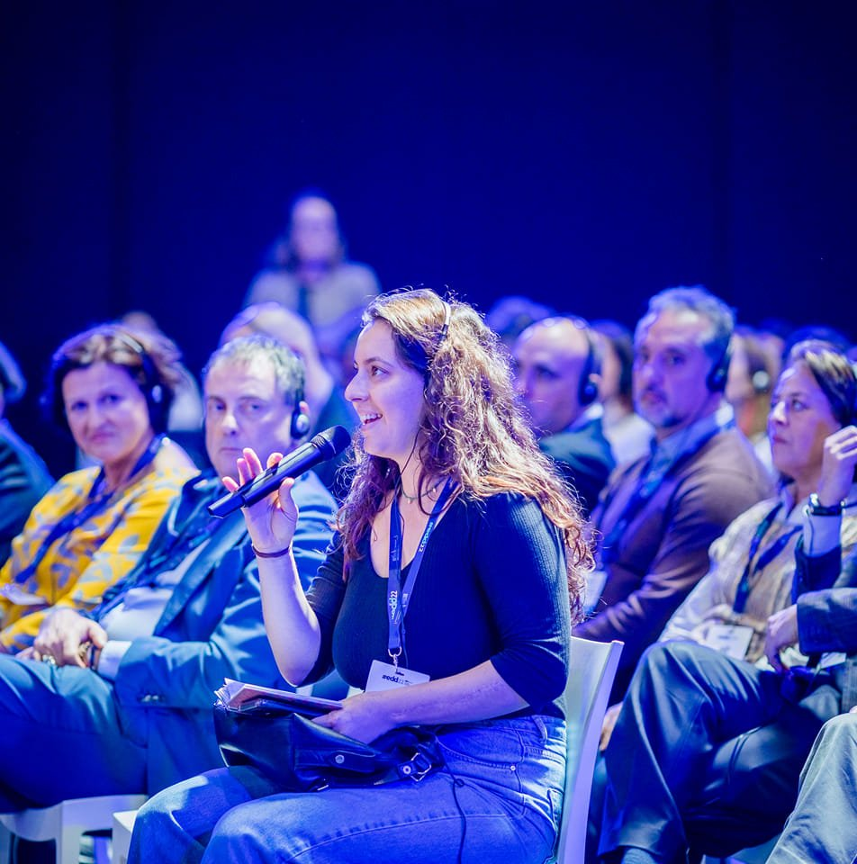

# Bárbara Carvalho Neves

  
    
  </a>

- 🔭 I’m currently working on my PhD research "Regionalism and Regional Infrastructure Development in South America: a three-level analysis", funded by FAPESP (20/04348-5).
- 📫 How to reach me: barbara.neves@unesp.br
- 😄 Pronouns: She/Her
- ⚡ Language Skills: Portuguese, Spanish, English, French and Dutch. 

## Abstract

- 👨🏻‍🎓 PhD Student and holds a Master Degree at the Interinstitutional Graduate Program in International Relations San Tiago Dantas (UNESP, UNICAMP, PUC-SP). Bachelor in Internacional Relations at São Paulo State University (UNESP).

- 💻 Researcher at the:
- <a href="http://observatorio.repri.org/"> Regionalism Observatory (ODR)</a>
- <a href="https://www.lantri.org/english"> The New Technologies Research Laboratory in International Relations (LANTRI) </a>
- <a href="https://gridale.org/"> Reflection Group on Integration and development in Latin America and Europe </a> 

## Skills 🔧

Programming Languages: C, C++, Java, PhP, JavaScript, Html.
Softwares: Excell, Tableau, Recoll, ...

## Connections
- 🔗 <a href="https://scholar.google.com/citations?user=77EGh2UAAAAJ&hl=en"> Google Scholar </a> 
- 🔗 <a href="https://unep.academia.edu/BarbaraNeves"> Academia.edu </a> 
- 🔗 <a href="https://www.researchgate.net/profile/Barbara-Neves-3"> Research Gate </a> 
- 🔗 <a href="https://www.linkedin.com/in/b%C3%A1rbara-neves-765055128/"> Linkedin </a> 
- 🔗 <a href="https://www.facebook.com/barbara.neves.104"> Facebook </a>
- 🔗 <a href="https://twitter.com/barbaracneves"> Twitter </a> 
